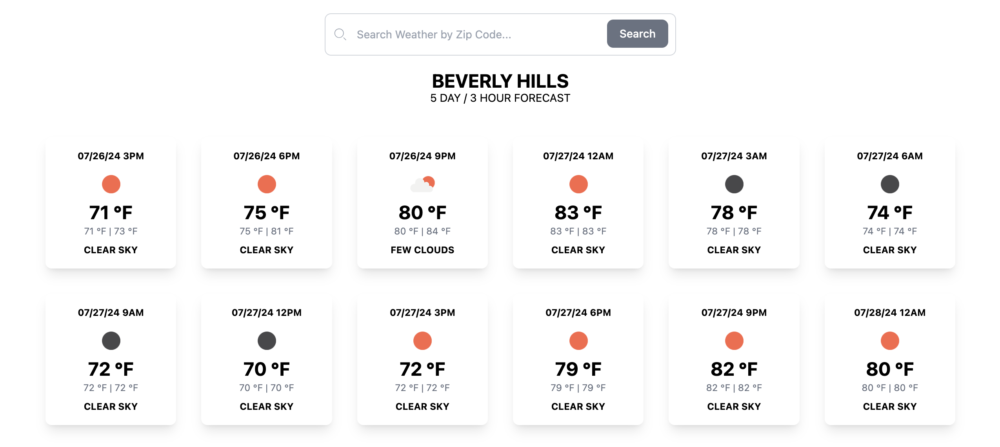

# Weather Forecast

### Problem

For this project, you'll create an app using the OpenWeatherAPI (https://openweathermap.org/api). The app should render pages that provide the 5 day weather forecast in 3 hour increments for any given zip code.

* Pages should render on the server, showing a 3 hour forecast for the next 5 days. There are a number of endpoints you could use for this, it's up to you how you want to achieve it.

* The structure of the pages should be '/weather/[zip]' where the zip code can be any US zip code. 
For example if I visit /weather/90210 I should see the forecast information for the next 5 days for Beverly Hills

* You can use any frontend framework you like, such as React, NextJS, Vue, Qwik or any other that your are most comfortable with

* If you can deploy the codebase to github and share a link, and ideally host the solution on Vercel or Netlify

* Design of the pages is up to you! This isn't a design challenge, but pages should be easy to understand and informative. A user landing on a random page should be able to understand what they're seeing.

## Solution

The [solution](https://weather-forecast-three-iota.vercel.app/) is deployed using Vercel >>

The Beverly Hills example is available [here](https://weather-forecast-three-iota.vercel.app/weather/90210) >>

